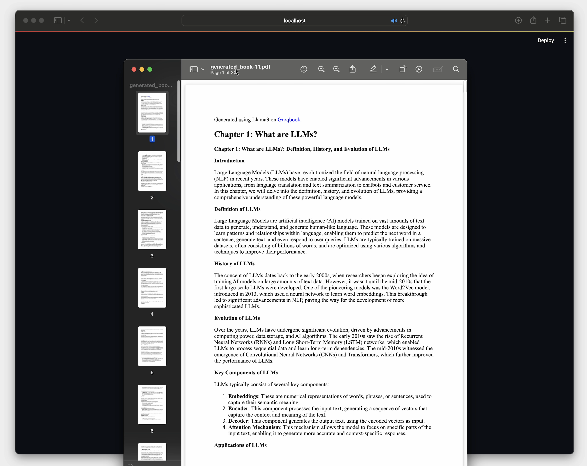

<h2 align="center">
   
  
  
  
 Infinite Bookshelf: Generate entire new books in seconds using Groq and Llama3
  
</h2>

 
 

 <a href="#Overview">Overview</a> •
 <a href="#Features">Features</a> •
 <a href="#Quickstart">Quickstart</a> •
 <a href="#Contributing">Contributing</a>

 

[Demo of Infinite Bookshelf](https://github.com/user-attachments/assets/e65d0bb8-b9db-492b-8da3-f13698e4e474)
> Imagine you want to learn about Natural Language Processing. You instantly get an 100 page book with chapters, content, and structure. What if you find the language too technical? You can change the prompt and the book – all 100 pages – adapts to your needs. What if you want to learn how to code the technology in python? You can ask for that too, and in seconds, every chapter has code examples alongside the instructional content. That’s the power of an Infinite Bookshelf.

---

## Overview

> Full demo of Infinite Bookshelf fast generation of book content

Infinite Bookshelf is a streamlit app that scaffolds the creation of books from a one-line prompt using Llama3 on Groq. It works well on nonfiction books and generates each chapter within seconds. The app mixes Llama3-8b and Llama3-70b, utilizing the larger model for generating the structure and the smaller of the two for creating the content. Currently, the model only uses the context of the section title to generate the chapter content. In the future, this will be expanded to the fuller context of the book to allow Infinite Bookshelf to generate quality fiction books as well.

---

## Features

- 📖 Scaffolded prompting that strategically switches between Llama3-70b and Llama3-8b to balance speed and quality
- 🖊️ Uses markdown styling to create an aesthetic book on the streamlit app that includes tables and code 
- 📂 Allows user to download a text file with the entire book contents

### Example Generated Books:

| Example                                      | Prompt                                                                                                                                |
| -------------------------------------------- | ------------------------------------------------------------------------------------------------------------------------------------------ |
| [LLM Basics](Example_1.md)             |  The Basics of Large Language Models                                       |
| [Data Structures and Algorithms](Example_2.md) | Data Structures and Algorithms in Java                                            |

---

## Quickstart

> [!IMPORTANT]
> To use Infinite Bookshelf, you can use the hosted version at [infinite.streamlit.app](https://infinite.streamlit.app)
> Alternatively, you can run Infinite Bookshelf locally with streamlit using the quickstart instructions.

### Hosted on Streamlit:

To use Infinite Bookshelf, you can use the hosted version at [infinite.streamlit.app](https://infinite.streamlit.app)

### Run locally:

Alternative, you can run Infinite Bookshelf locally with streamlit.

#### Step 1
First, you can set your Groq API key in the environment variables:

~~~
export GROQ_API_KEY="gsk_yA..."
~~~

This is an optional step that allows you to skip setting the Groq API key later in the streamlit app.

#### Step 2
Next, you can set up a virtual environment and install the dependencies.

~~~
python3 -m venv venv
~~~

~~~
source venv/bin/activate # Bash

venv\Scripts\activate.bat # Windows
~~~

~~~
pip3 install -r requirements.txt
~~~

#### Step 3 (Windows Only)
It may be required to install gtk3 for users on windows.

~~~
https://github.com/tschoonj/GTK-for-Windows-Runtime-Environment-Installer?tab=readme-ov-file
~~~

#### Step 4
Finally, you can run the streamlit app.

~~~
python3 -m streamlit run main.py
~~~

## Details

### Technologies

- Streamlit
- Llama3 on Groq Cloud

### Limitations

Infinite Bookshelf may generate inaccurate information or placeholder content. It should be used to generate books for entertainment purposes only.

## Contributing

Improvements through PRs are welcome!

## Changelog

### v0.2.0
May 29th, 2024:

> Added new inference statistics

### v0.3.0
June 8th, 2024:

> Download Books as Styled PDFs

### Future Features:
- Ability to title books which shows on downloads
- Ability to save books to Google drive
- Optional seed content field to input existing notes
